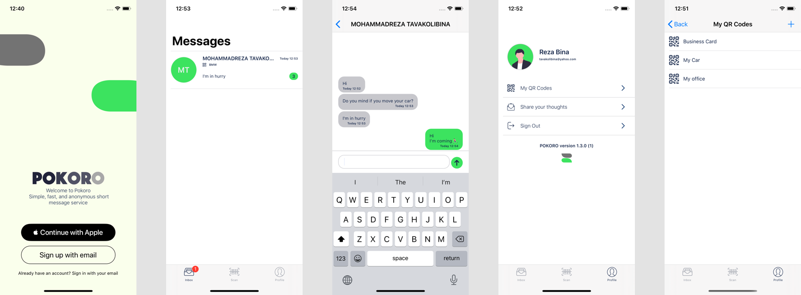

# Pokoro - Scan. Chat

  

Pokoro is a simple, fast and Anonymous instant messaging service that lets you send and receive text messages with a QR code. All you have to do is to create a QR and put it on your business card or in your car or...
Anyone can send you a message without knowing your phone number or email address.  

* **Real-time connection**
  It uses socket.io for real-time connection to the server and sync its own database with the server.
* **Combine**
  Chat models use combine framework to communicate to eachother.
* **Database**
  It uses coredata to save messages in sqlite DB.
* **Dark-Mode**
  Pokoro supports dark-mode and light-mode in iOS 13.0

  

  

### App Store

You can use the link below to download the beta version:
https://apps.apple.com/lt/app/pokoro-scan-chat/id1501165249

